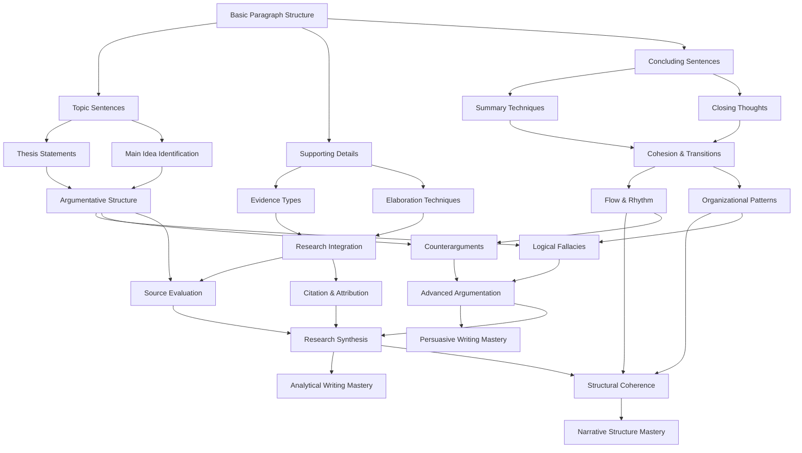

# Sequencing & Logic Skill Tree

This document outlines the skill tree for the Sequencing & Logic layer of writing instruction in ScribexX. This represents the second layer in the three-layer writing instruction model, focusing on argument structure, logical flow, and content generation.

## Skill Tree Overview

The Sequencing & Logic skill tree is designed as a directed acyclic graph (DAG) where students progress through increasingly complex concepts of organizing and structuring their writing.

## Skill Descriptions

### Foundation Skills

- **Basic Paragraph Structure**: Learn the fundamental components of a well-structured paragraph.
- **Topic Sentences**: Craft effective opening sentences that establish the main idea of a paragraph.
- **Supporting Details**: Select and organize relevant details that support the main idea.
- **Concluding Sentences**: Create effective paragraph closures that reinforce the main idea.

### Intermediate Skills

- **Thesis Statements**: Develop clear, focused thesis statements that guide entire essays.
- **Main Idea Identification**: Identify and articulate the central concept of any text.
- **Evidence Types**: Distinguish between facts, statistics, examples, and expert opinions.
- **Elaboration Techniques**: Expand on ideas through explanation, analysis, and illustration.
- **Summary Techniques**: Condense complex information into concise, accurate summaries.
- **Closing Thoughts**: Craft conclusions that leave a lasting impression on readers.

### Advanced Skills

- **Argumentative Structure**: Organize claims, evidence, and reasoning in logical sequences.
- **Research Integration**: Seamlessly incorporate research findings into original writing.
- **Cohesion & Transitions**: Create smooth connections between ideas, paragraphs, and sections.
- **Logical Fallacies**: Identify and avoid common reasoning errors in argumentation.
- **Counterarguments**: Acknowledge and address opposing viewpoints effectively.
- **Source Evaluation**: Assess the credibility, relevance, and bias of information sources.
- **Citation & Attribution**: Properly credit sources using appropriate citation formats.
- **Flow & Rhythm**: Control the pace and rhythm of writing through sentence variety.
- **Organizational Patterns**: Apply various organizational frameworks (chronological, spatial, etc.).

### Mastery Skills

- **Advanced Argumentation**: Construct sophisticated, nuanced arguments with multiple layers.
- **Research Synthesis**: Integrate diverse sources into a cohesive, original analysis.
- **Structural Coherence**: Maintain unity and coherence across complex, multi-part texts.
- **Persuasive Writing Mastery**: Combine logical, emotional, and ethical appeals effectively.
- **Analytical Writing Mastery**: Break down complex subjects into clear, insightful components.
- **Narrative Structure Mastery**: Craft compelling narratives with sophisticated plot structures.

## Implementation Notes

Each skill node in this tree should include:

1. A brief lesson explaining the concept
2. Examples demonstrating the skill in action
3. Guided practice exercises with scaffolding
4. Independent